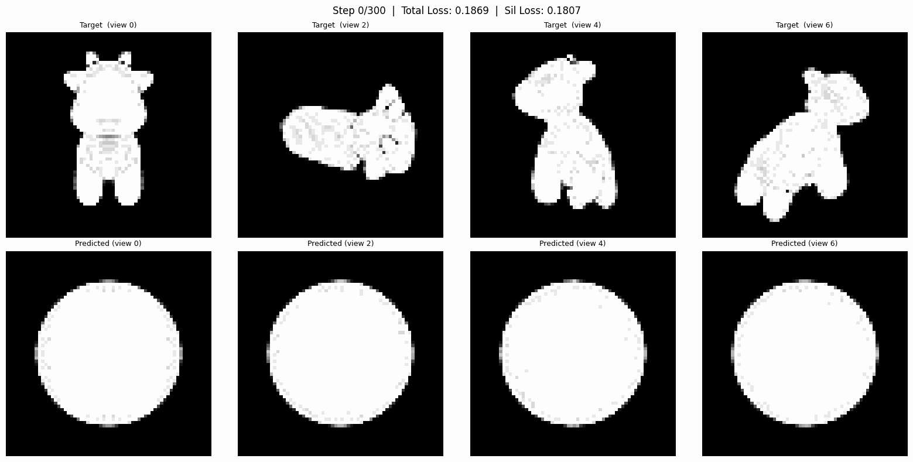
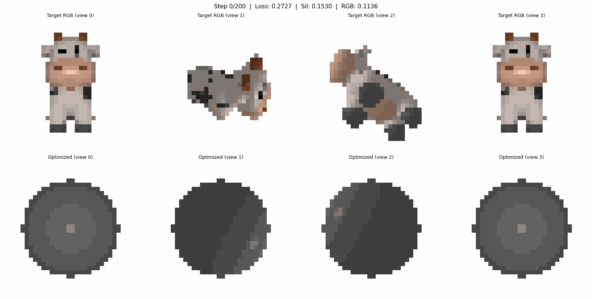
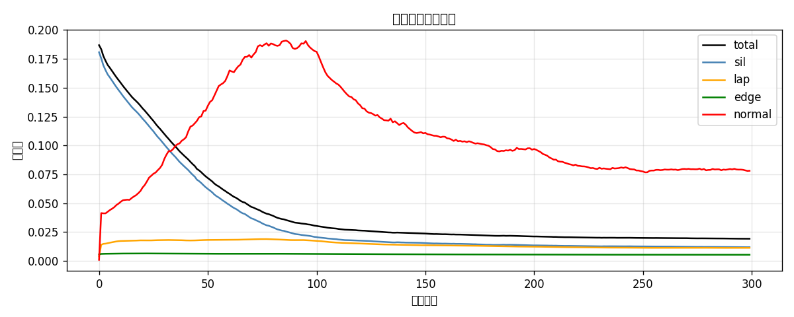
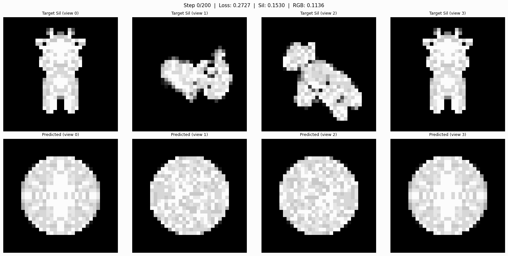

学号：202411030128
姓名：付雄亮
专业：计算机科学与技术

# 实验六：可微光栅化——把球体"捏"成奶牛

## 效果展示

**Part 1：剪影优化（球体 → 奶牛形状，300 步）**



**Part 2：联合纹理优化（形状 + 颜色，200 步）**



---

## 一、实验目标

- 理解软光栅化（Soft Rasterization）的原理，搞清楚为什么传统硬光栅化在边界处梯度为零，以及 $\sigma$ 参数控制什么
- 通过 20 个视角的二维剪影图，反推并优化三维网格的顶点坐标
- 理解三种正则化（拉普拉斯、边长、法线）各自防止什么问题，以及权重取值的影响
- 选做：在剪影优化的基础上同时拟合 RGB 外观（联合纹理优化）

---

## 二、实验原理

### 2.1 软光栅化（解决梯度消失）

传统硬光栅化对每个像素只返回 0 或 1——要么在三角形内，要么在外。边界处的导数是零，优化器收不到任何信号，顶点不知道该往哪个方向走。

软光栅化的核心想法：把"在不在三角形里"这个硬判断，换成基于带符号距离 $d$ 的连续概率值：

$$A(d) = \sigma\!\left(\frac{d}{\sigma}\right) = \frac{1}{1 + e^{-d/\sigma}}$$

$d > 0$ 表示像素在三角形内，$d < 0$ 在外面。$\sigma$ 控制边缘模糊程度——越小越接近硬光栅化，越大边缘越模糊。关键在于 sigmoid 在 $d=0$ 处导数不为零，不管顶点在哪里都能收到梯度。

代码里的 `blur_radius` 由 $\sigma$ 推导，把概率低于 $10^{-4}$ 的像素排除掉（省去无意义计算）：

```python
blur_radius = np.log(1.0 / 1e-4 - 1.0) * sigma
```

### 2.2 网格正则化（防止拓扑崩坏）

只用剪影误差推动顶点移动会有严重问题：顶点会为了迎合某个视角的投影疯狂移动，最终三角面互相穿插、边长极度退化，网格变成"刺猬"彻底陷入局部最优。为此引入三项正则化：

| 正则化项 | 作用 | 权重 |
|:---|:---|:---|
| 拉普拉斯平滑 $L_\text{lap}$ | 每个顶点被约束向邻居平均位置靠拢，抑制局部尖刺 | `w_lap = 0.1` |
| 边长一致性 $L_\text{edge}$ | 惩罚过长或过短的边，防止三角形退化 | `w_edge = 1.0` |
| 法线一致性 $L_\text{normal}$ | 相邻面法线方向要接近，保持表面平滑 | `w_normal = 0.01` |

总损失：

$$L_\text{total} = L_\text{sil} + w_\text{lap} \cdot L_\text{lap} + w_\text{edge} \cdot L_\text{edge} + w_\text{normal} \cdot L_\text{normal}$$

`w_edge = 1.0` 故意设得比其他项大，因为边长崩坏是迭代早期最容易出现的拓扑问题。

---

## 三、项目结构

```
lab6_diff_render/
├── utils.py              # 渲染器构建、相机设置、网格归一化、数据下载
├── main_silhouette.py    # Part 1：剪影优化（球 → 奶牛形状）
├── main_texture.py       # Part 2（选做）：联合纹理优化（形状 + 颜色）
├── pyproject.toml        # uv 依赖配置（torch 2.4.0 CPU）
└── output/               # 运行后自动生成
    ├── silhouette/       # Part 1 输出帧、loss 曲线、GIF
    └── texture/          # Part 2 输出帧、loss 曲线、GIF
```

---

## 四、环境配置

pytorch3d 目前（0.7.x）最高支持 PyTorch 2.4.x，**不能用系统里的 torch 2.6**，需要单独建环境。

### 方法一：Conda（Windows 推荐）

```bash
conda create -n p3d python=3.11
conda activate p3d
conda install pytorch==2.4.0 torchvision==0.19.0 cpuonly -c pytorch
pip install matplotlib tqdm imageio pillow scipy
```

### 方法二：WSL2 / Linux（推荐，从源码编译 pytorch3d）

```bash
# 安装 uv（快速 Python 包管理器）
curl -LsSf https://astral.sh/uv/install.sh | sh && source ~/.local/bin/env

# 创建 Python 3.11 虚拟环境
uv python install 3.11
uv venv ~/lab6_env --python 3.11

# 安装依赖
PY=~/lab6_env/bin/python
uv pip install --python $PY torch==2.4.0 torchvision==0.19.0 \
  --index-url https://download.pytorch.org/whl/cpu
uv pip install --python $PY matplotlib tqdm imageio pillow scipy fvcore iopath

# 从源码编译 pytorch3d（需要 GCC，约 20-40 分钟）
$PY -m pip install setuptools wheel ninja
$PY -m pip install --no-build-isolation \
  'git+https://github.com/facebookresearch/pytorch3d.git@stable'
```

配置好后可以直接用 `run_wsl2.sh` 一键运行：

```bash
bash run_wsl2.sh all    # 依次运行 Part1 + Part2
bash run_wsl2.sh part1  # 只运行剪影优化
```

### 方法三：uv

```bash
cd lab6_diff_render
uv sync

# pytorch3d Linux wheel（仅 Linux/macOS，Python 3.11 + CPU + torch 2.4.0）
pip install pytorch3d \
  -f https://dl.fbaipublicfiles.com/pytorch3d/packaging/wheels/py311_cpu_pyt240/download.html
```

> **验证安装**
> ```python
> import pytorch3d; print(pytorch3d.__version__)  # 期望 0.7.x
> ```

---

## 五、运行方法

```bash
# Part 1：剪影优化（300 步，CPU 约 20~40 分钟）
python main_silhouette.py

# Part 2（选做）：联合纹理优化（300 步，CPU 约 30~60 分钟）
python main_texture.py
```

第一次运行会自动从 Facebook CDN 下载奶牛网格（`cow.obj` + 纹理，约 2 MB）到 `data/cow_mesh/`。

输出文件说明：

| 文件 | 说明 |
|:---|:---|
| `output/silhouette/frame_XXXX.png` | 每 50 步的 4 视角对比截图 |
| `output/silhouette/loss_curve.png` | 各项损失随迭代的变化曲线 |
| `output/silhouette/optimization.gif` | 完整优化过程动画 |
| `output/texture/sil_XXXX.png` | Part 2 剪影对比帧 |
| `output/texture/rgb_XXXX.png` | Part 2 RGB 对比帧 |
| `output/texture/rgb_optimization.gif` | Part 2 颜色优化动画 |

---

## 六、实验结果

### Part 1：剪影优化

**损失曲线（Part 1）：**



300 步迭代后，从 8 个视角看，球体的轮廓已经和奶牛剪影基本对齐，躯干、腿部、头部的大致形态都能识别出来。

**关键参数的影响：**

- **`sigma = 1e-4`**：平衡点。太大（如 `1e-2`）边缘模糊导致轮廓失真；太小接近硬光栅化，边界梯度趋向零，优化停滞。
- **`w_lap = 0.1`**：拉普拉斯权重过大网格过度平滑，奶牛腿等细节消失；过小会出现局部尖刺。
- **`w_edge = 1.0`**：权重最大，因为边长退化是最先发生、也最难恢复的拓扑破坏。
- **`sphere_level = 4`**：2562 个顶点 / 5120 个三角面，顶点密度足够表达奶牛体型，CPU 上仍可接受。
- **学习率调度**：每 100 步学习率减半（`1e-2 → 5e-3 → 2.5e-3`），前期快速收敛，后期精细调整。

### Part 2（选做）：联合纹理优化

**RGB 优化过程（4 个视角，200 步）：**


**剪影优化对比（Part 2）：**



在 Part 1 的基础上新增了两点：

1. `verts_rgb_raw`（logit 空间的顶点颜色）作为第二个可微参数，经过 `sigmoid` 映射到 $(0, 1)$ 保证合法性且避免 `clamp` 在边界处梯度为零的问题。
2. `SoftPhongShader` 渲染 RGB 图像，与目标 RGB 计算 MSE 损失，和剪影损失一起反向传播。

颜色收敛比形状快，50~80 步内颜色就趋近目标了；形状则需要更多迭代。两组参数使用不同学习率（顶点位移 `5e-3`，颜色 `1e-1`）放在同一个 Adam 优化器中。

---

## 七、代码说明

### `utils.py`

**`setup_cameras`**：在球面上均匀分布 N 个视角，用 `look_at_view_transform` 生成旋转矩阵。多视角是这个方法成立的前提——单视角会导致对称性歧义（正前方看左右对称，优化器分不清）。

**`build_silhouette_renderer`**：把 `blur_radius`、`faces_per_pixel`、`BlendParams(sigma)` 组合成 `SoftSilhouetteShader`。`faces_per_pixel=50` 表示每像素最多考虑 50 个重叠的三角面，这个值影响精度和速度。

**`normalize_mesh`**：先减均值中心化，再除以最大坐标幅度，把网格缩放到单位球内。不归一化的话相机距离参数无法统一。

### `main_silhouette.py` 核心优化循环

```python
deform_verts = torch.zeros((n_verts, 3), device=device, requires_grad=True)

for step in range(num_iter):
    new_mesh  = src_mesh.offset_verts(deform_verts)      # 形变
    pred_sil  = render_silhouettes(new_mesh, cameras, renderer)
    loss_sil  = torch.mean((pred_sil - target_silhouettes) ** 2)
    loss_total = loss_sil + w_lap*loss_lap + w_edge*loss_edge + w_normal*loss_normal
    loss_total.backward()
    optimizer.step()
```

`offset_verts(deform_verts)` 是 pytorch3d 的形变接口，不修改原始球体，直接返回新 `Meshes`。`mesh.extend(n)` 把单个网格复制 n 份与 n 个相机批量渲染，省去手动循环。

### `main_texture.py` 颜色优化的关键设计

```python
# 初始为 0：sigmoid(0) = 0.5，中性灰，避免颜色偏置
verts_rgb_raw = torch.zeros((1, n_verts, 3), device=device, requires_grad=True)

# 每步循环中
verts_rgb = torch.sigmoid(verts_rgb_raw)  # (1, V, 3)，映射到 (0, 1)
textures  = TexturesVertex(verts_features=verts_rgb)
new_mesh  = Meshes(verts=[...], faces=[...], textures=textures)
```

用 logit 空间参数化颜色（不直接对颜色值做 `clamp`），使整个颜色范围内都有非零梯度。

---

## 八、思考与总结

这个实验的核心矛盾是：3D 几何是离散的（顶点、三角面），但优化需要连续可微的信号。软光栅化用 sigmoid 函数在几何边界处"模糊"出一个可微区域，从而把 2D 像素误差的梯度传回到 3D 顶点位置。

正则化的必要性体现在：如果只看剪影误差，优化器对"三角面是否交叉"毫不在意，只要投影轮廓对就行。三项正则化分别从局部平滑（拉普拉斯）、边长分布（边长惩罚）、面法线连续性（法线一致）三个维度约束网格保持合理的物理结构。

联合纹理优化增加了一个有趣的现象：颜色收敛比形状快很多，因为颜色空间是凸且平滑的（sigmoid 后直接 MSE），而几何优化有更多局部极小和正则化的干扰。两组参数使用不同学习率的设计正是为了应对这种收敛速度的差异。

---

## 参考资料

- [pytorch3d fit_textured_mesh notebook](https://github.com/facebookresearch/pytorch3d/blob/main/docs/tutorials/fit_textured_mesh.ipynb)
- [pytorch3d deform_source_mesh_to_target_mesh notebook](https://github.com/facebookresearch/pytorch3d/blob/main/docs/tutorials/deform_source_mesh_to_target_mesh.ipynb)
- Liu et al. "Soft Rasterizer: A Differentiable Renderer for Image-based 3D Reasoning" ICCV 2019
- Loper & Black "OpenDR: An Approximate Differentiable Renderer" ECCV 2014

---

北京师范大学 · 计算机图形学实验
